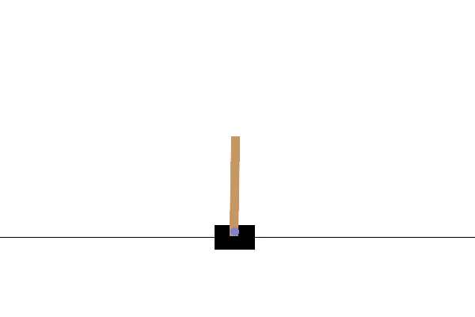
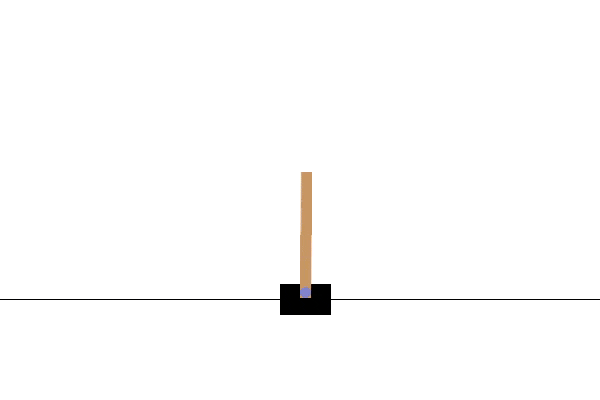

# tortoise-achilles-crab-lab
First deep reinforcement learning library, working through the easier Gymnasium Classic Control and Box2D environments; closely following Laura Graesser and Wah Loon Keng's book Foundations of Deep Reinforcement Learning and reimplementing their accompanying framework, SLM Lab. 

## Agent-Environment implementation
| Environment | Type | Training start | Training end | REINFORCE | SARSA | DQN | A2C | PPO | A3C | 
| :---: | :---: | :---: | :---: | :---: | :---: | :---: | :---: | :---: | :---: |
| Cartpole | Classic Control |  |  | (✓ mvp) |  |  |  |  |
| Pendulum | Classic Control |  |  |  |  |  |  |  |
| Mountain Car (Disc) | Classic Control |  |  |  |  |  |  |  |
| Acrobot | Classic Control |  |  |  |  |  |  |  |
| Lunar Lander | Box2D |  |  |  |  |  |  |  |
| Bipedal Walker | Box2D |  |  |  |  |  |  |  |

## DRL Algorithms
| Agent | Implemented? | Type | Pros | Cons | Notes |
| :---: | :---: | :---: | :---: | :---: | :---: |
| REINFORCE | ✓ | `Policy gradient` | - Smooth action probability distribution (vs e.g. discontinuous e-greedy)   - Policy potentially simpler function to approximate than value functions   - Can approach deterministic policy | - High variance (without baseline)   - Sample inefficient    -No guarantee of efficient exploration | Only simplest version implemented: next implement version with baseline  |
| SARSA |  | `Value-based` |  | - Limited to discrete action spaces |  |
| DQN |  | `Value-based` |  | - Limited to discrete action spaces |  |
| A2C |  |  |  |  |  |
| PPO |  |  |  |  |  |
| A3C |  |  |  |  |  |

## Nomenclature
| Symbol / name | Meaning |
| :---: | :---: |
| $\pi_{\theta}$ | **Policy (parametrised)**: A function which outputs stochastic actions, given a state: $a \sim \pi(s)$. Neural net used as function approximator, with learnable parameters $\theta$ |
| $R(\tau)$ | Return of a trajectory (at time step 0; if mid-way through an episode, subscripted by t; $R_t(\tau)$ |
| $J(\pi_{\theta})$ | Objective function: expected return over all trajectories generated by an agent |
| $\nabla_{\theta}J(\pi_{\theta})$ | Policy gradient: used in gradient ascent update equation to maximise the objective |
| `frame` | A single time-step of an environment, $s_t$ |
| `experience` | A $(s_t, a_t, r_t)$ tuple, or alternatively, a $(s_t, a_t, r_t, s_{t+1}, done)$ tuple |
| Trajectory (roll-out): $\tau$ | **Trajectory**: a sequence of state-action-rewards, $s_t, a_t, r_t, ..., s_T, a_T, r_T$, sampled from a policy, $\tau \sim \pi$ |
| `episode` | A full set of experiences, from t = 0 to termination t = T. Trajectory is a sub-set of episode (e.g. a trajectory can be defined as a contiguous sequence starting from t > 0 |
| `session` | **Level 0**: Initialisation and training of RL agent using specific set of hyperparameters and random seed |
| `trial` | **Level 1**: Multiple sessions: same hyperparameters, different random seeds |
| `experiment` | **Level 2**: Different sets of hyperparameters, with a trial for each one |
